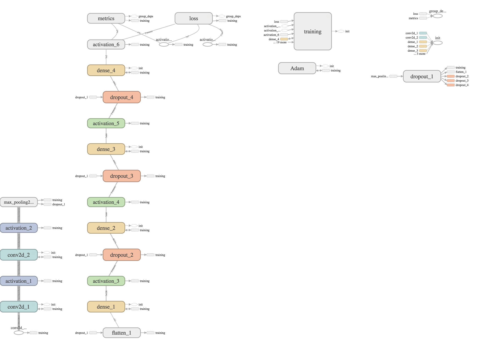

# EyeNet

## Treatment of Diabetic Retinopathy Using Deep Learning

## Objective

Diabetic retinopathy is the leading cause of blindness in the working-age population of the developed world. It is estimated to affect over 93 million people.

The need for a comprehensive and automated method of diabetic retinopathy screening has long been recognized, and previous efforts have made good progress using image classification, pattern recognition, and machine learning. With photos of eyes as input, the goal of this capstone is to create a new model, ideally resulting in realistic clinical potential.

The motivations for this project are twofold:

* Image classification has been a personal interest for years, in addition to classification
on a large scale data set.

* Time is lost between patients getting their eyes scanned, having them analyzed by doctors, and scheduling a follow-up appointment. By processing images in real-time, EyeNet would allow people to seek & schedule treatment the same day.

## Table of Contents
1. [Data](#data)
2. [Exploratory Data Analysis](#exploratory-data-analysis)
3. [Preprocessing](#preprocessing)
    * [Download Images to EC2](#download-all-images-to-ec2)
    * [Crop & Resize Images](#crop-and-resize-all-images)
    * [Rotate and Mirror All Images](#rotate-and-mirror-all-images)
4. [CNN Architecture](#neural-network-architecture)
5. [Results](#results)
6. [Next Steps](#next-steps)
7. [References](#references)

## Data

The data originates from a [2015 Kaggle competition](https://www.kaggle.com/c/diabetic-retinopathy-detection). However, is an atypical Kaggle dataset. In most Kaggle competitions, the data has already been cleaned, giving the data scientist very little to preprocess. With this dataset, this isn't the case.

All images are taken of different people, using different cameras, and of different sizes. Pertaining to the [preprocessing](#preprocessing) section, this data is extremely noisy, and requires multiple preprocessing steps to get all images to a useable format for training a model.

The training data is comprised of 35,126 images, which was augmented during preprocessing.

## Exploratory Data Analysis

The very first item analyzed was the training labels. While there are
five categories to predict against, the plot below shows the severe class imbalance in the original dataset.

Of the original training data, 25,810 images are classified as not having retinopathy,
while 9,316 are classified as having retinopathy.

Due to the class imbalance, steps (shown below) were taken in preprocessing in order to rectify the imbalance, and when training the model.

## Preprocessing

The preprocessing pipeline is the following:

1. Download all images to EC2 using the [download script](src/download_data.sh).
2. Crop & resize all images using the [resizing script](src/resize_images.py) and the [preprocessing script](src/preprocess_images.py).
3. Rotate & mirror all images using the [rotation script](src/rotate_images.py).
4. Convert all images to array of NumPy arrays, using the [conversion script](src/image_to_array.py).

### Download All Images to EC2
The images were downloaded using the Kaggle CLI. Running this on an EC2 instance
allows you to download the images in about 30 minutes. All images are then placed
in their respective folders, and expanded from their compressed files. In total,
the original dataset totals 35 gigabytes.

### Crop and Resize All Images
All images were scaled down to 256 by 256. Despite taking longer to train, the
detail present in photos of this size were much greater then at 128 by 128.

Additionally, 403 images were dropped from the training set. Scikit-Image raised
multiple warnings during resizing, due to these images having no color space.
Because of this, any images that were completely black were removed from the
training data.

### Rotate and Mirror All Images
All images were rotated and mirrored.Images without retinopathy were mirrored;
images that had retinopathy were mirrored, and rotated 90, 120, 180, and 270
degrees.

The first images show two pairs of eyes, along with the black borders. Notice in
the cropping and rotations how the majority of noise is removed.

After rotations and mirroring, the class imbalance is rectified, with a few thousand
more images having retinopathy.

## Neural Network Architecture

The model is built using Keras, utilizing TensorFlow as the backend.
TensorFlow was chosen as the backend due to better performance over
Theano, and the ability to visualize the neural network using TensorBoard.

The architecture for the neural network is the following:

* 3 Convolution (2D) layers
* 1 Pooling layer
* 2 Dense layers, with the final layer being for classification

## Results
The model was created to classify whether or not a patient has retinopathy.
The best model performs with 82% accuracy on the training data, and 80%
accuracy on the test and validation data.

## Next Steps
1. Program the neural network to retrain with new photos.
2. Port the Keras model to CoreML, and deploy to an EyeNet iOS application.

## References

1. [What is Diabetic Retinopathy?](http://www.mayoclinic.org/diseases-conditions/diabetic-retinopathy/basics/definition/con-20023311)

2. [Diabetic Retinopathy Winners' Interview: 4th place, Julian & Daniel](http://blog.kaggle.com/2015/08/14/diabetic-retinopathy-winners-interview-4th-place-julian-daniel/)

3. [TensorFlow: Machine Learning For Everyone](https://youtu.be/mWl45NkFBOc)

## Tech Stack

