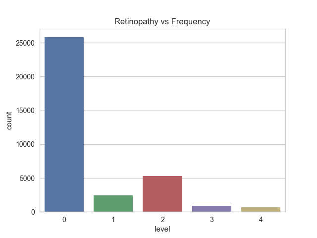

# EyeNet - Treatment of Diabetic Retinopathy Using Deep Learning

## Objective

Diabetic retinopathy is the leading cause of blindness in the working-age population of the developed world. It is estimated to affect over 93 million people.

The need for a comprehensive and automated method of DR screening has long been recognized, and previous efforts have made good progress using image classification, pattern recognition, and machine learning. With photos of eyes as input, the goal of this capstone is to create a new model, ideally resulting in realistic clinical potential.

## Motivations

* Image classification had been a personal interest before the cohort began, along with classification on a large scale.

* Time is lost between getting your eyes scanned, having them analyzed, and scheduling a follow-up appointment. By being able to process images in real-time, this project allows people to seek & schedule treatment the same day.

## Table of Contents
1. [Data](#data)
2. [Exploratory Data Analysis](#exploratory-data-analysis)
3. [Preprocessing](#preprocessing)
4. [CNN Architecture](#neural-network-architecture)
5. [Next Steps](#next-steps)
6. [References](#references)

## Data

The data originates from a [2015 Kaggle competition](https://www.kaggle.com/c/diabetic-retinopathy-detection). However, this data isn't a typical Kaggle dataset. In most Kaggle competitions, the data has already been cleaned, giving the data scientist very little to preprocess. With this dataset, this isn't the case.

All images are taken of different people, using different cameras, and of different sizes. Pertaining to the preprocessing section, this data is extremely noisy, and requires multiple preprocessing steps to get all images to a useable format for training a model.

The training data is comprised of 35,126 images, while the test data is 53,576 images.

## Exploratory Data Analysis

The very first item analyzed was the training labels. While there are
five categories to predict against, the plot below shows the severe class imbalance in the original dataset.

Of the original training data, 25,810 images are classified as not having retinopathy,
while 9,316 are classified as having retinopathy.

Due to the class imbalance, steps were taken in preprocessing in order to rectify the imbalance, and when training the model.

## Preprocessing

The preprocessing pipeline is the following:

1. Download all images to EC2 using the [download script](src/download_data.sh).
2. Crop & resize all images using the [resizing script](src/resize_images.py) and the [preprocessing script](src/preprocess_images.py).
3. Rotate images (pertaining to class imbalance).
4. Convert all images to array of NumPy arrays, using the [conversion script](src/image_to_array.py).

### Crop All Images
All images were scaled down to 256 by 256. Despite taking longer to train, the
detail present in photos of this size were much greater then at 128 by 128.

Additionally, 403 images were dropped from the training set. Scikit-Image raised
multiple warnings during resizing, due to the images having no color space in them.
Because of this, any images that were completely black were removed from the
training data.

## Neural Network Architecture

The model is built using Keras, utilizing TensorFlow as the backend.
TensorFlow was chosen as the backend due to better performance over
Theano, and the ability to visualize the neural network using TensorBoard.

## Next Steps

## References

1. [What is Diabetic Retinopathy?](http://www.mayoclinic.org/diseases-conditions/diabetic-retinopathy/basics/definition/con-20023311)

2. [Diabetic Retinopathy Winners' Interview: 4th place, Julian & Daniel](http://blog.kaggle.com/2015/08/14/diabetic-retinopathy-winners-interview-4th-place-julian-daniel/)
